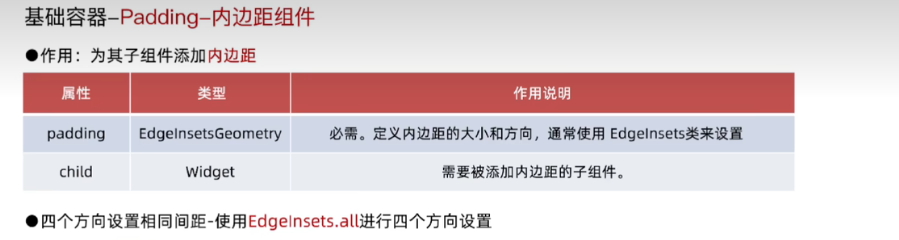
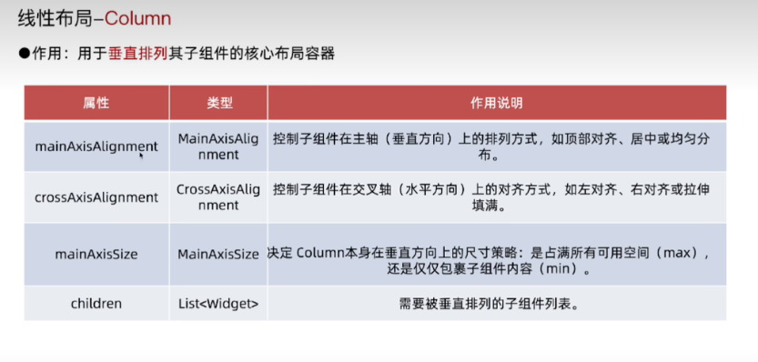
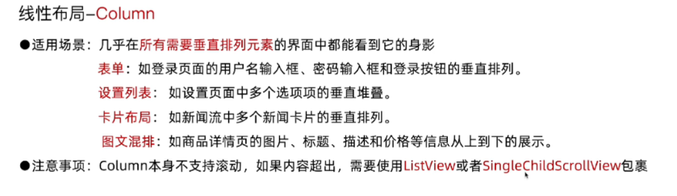
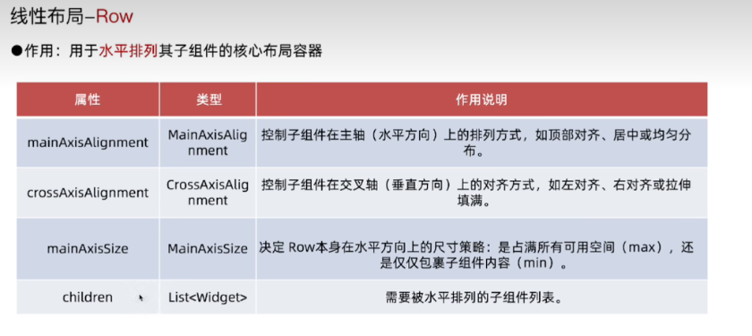
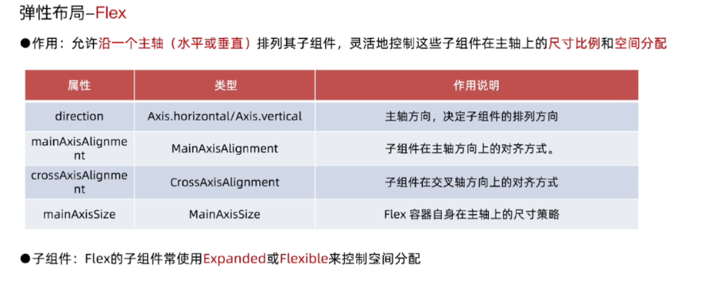
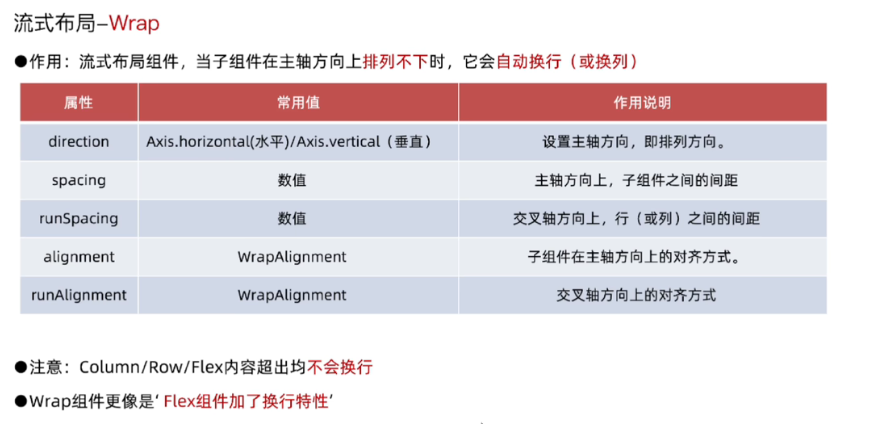
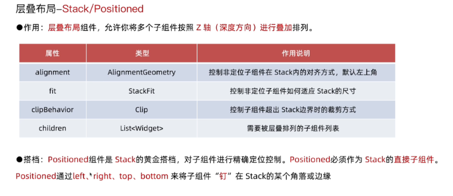
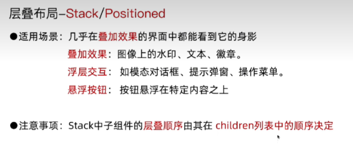

### scaffold

### stateless & statefull

#### lefecycle

- stateless

  创建，或当父组件状态更新时，调用 `build`

- statefull

  

### 点击事件

### 布局组件介绍

#### container

#### center
应用场景：页面整体居中

注意事项：

- center 不能设置宽高，最终大小取决于其父组件传递给它的约束
- center 会向它的父组件申请尽可能大的空间

如需实现固定宽高且居中的组件，可以使用 center 去包裹一个具有固定宽高的子组件，如 container/sizedbox

#### align
作用：精确控制其子组件在父容器控件内的对齐方式
应用场景：当需要将一个组件放置在父容器的特定角落，align 是理想选择

- alignment 对齐方式
- widthfactor 宽度因子 align 的宽度将是子组件的宽度乘以该因子
- heightfactor 高度因子 align 的高度将是子组件的高度乘以该因子
- 通过 widthfactor 和 heightfactor 可以创建出与子组件大小成比例的容器

center 其实是 align 的一个特例，（继承自 align），相当于设置了 `alignment = Align.center`

#### padding

应用场景：添加内边距

container 也有 padding 属性，单一需求可以使用 padding，复杂场景使用 container

#### column

#### row

使用场景：

- 需要水平排列元素
- 导航栏
- 图文混排
- 表单行

注意：row 本身不支持滚动，如果内容超出，需要使用 listview 或 singlechildscrollview 包裹明确尺寸约束，父组件大小直接影响 row 的最终大小和子组件的布局行为

#### flex

expanded/flexible 作为 flex 子组件通过 flex 属性来分配 flex 组件空间

#### wrap

#### stack/positioned

